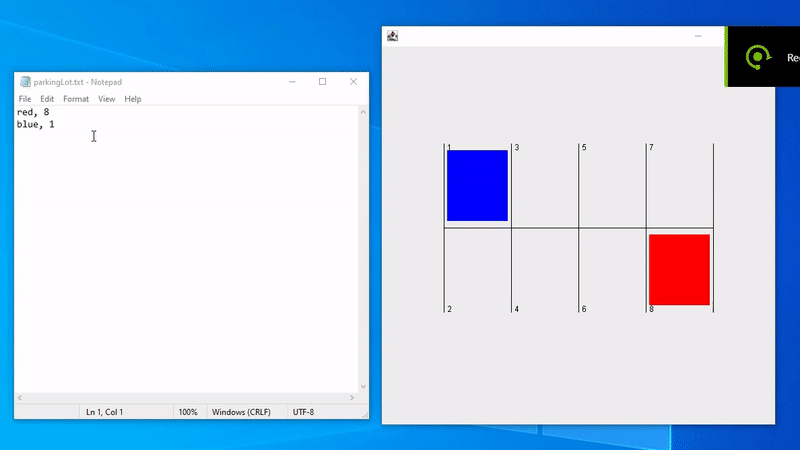

# Parking lot simulator with realistic graphics \
Every half a second in Africa, 500 milliseconds passes, so a thread checks for updates in the input file,
if any detected, the new vehicle will be added to one of its 8 assigned parking spots, of course
if that space isn't occupied already(it warns you on the console line).

 / ! 